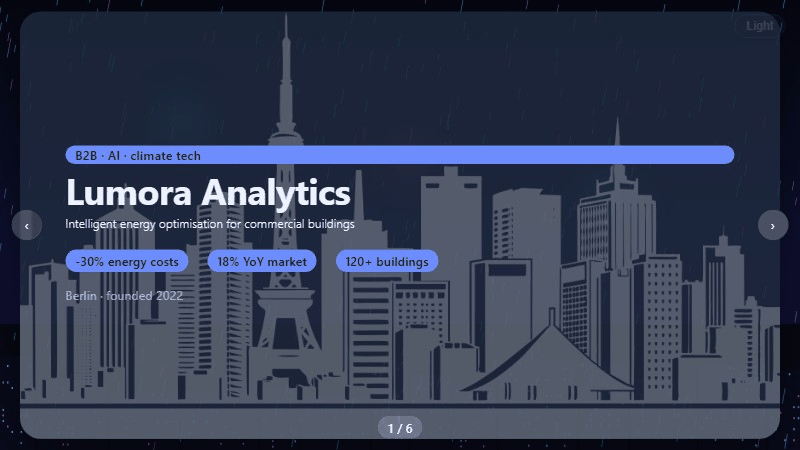
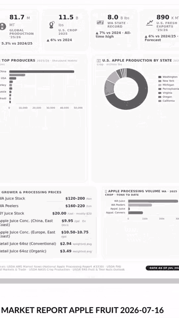
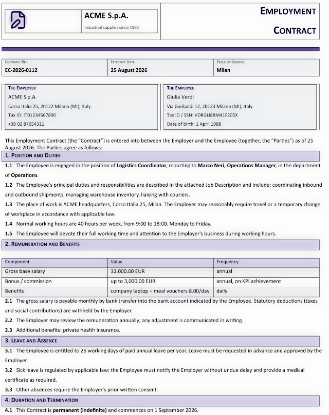
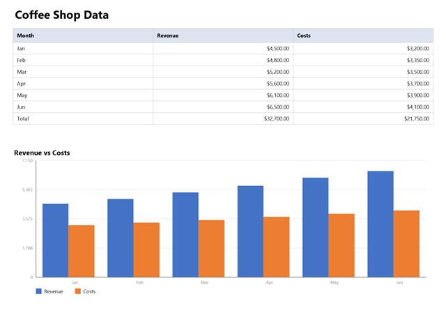

# AMD Ryzen AI Max+ 395 Privacy Agent

[](https://graphenelab.it/AgentBridge/install.ps1)
[](https://graphenelab.it/AgentBridge/install.sh)
[](https://github.com/Graphene-Lab/AgentBridge/releases/latest)


> **The AMD Ryzen AI Max+ 395 Privacy Agent turns a Windows or Linux machine powered by the AMD Ryzen AI Max+ 395 processor into a private, self-hosted AI office assistant.** Built on [AgentBridge](https://github.com/Graphene-Lab/AgentBridge), it reads your documents, writes office files, manages email, researches the web, speaks with a neural voice, answers the phone, chats on Telegram, schedules tasks and even produces podcasts — while your data stays on your machine and never reaches a cloud.

**AMD Ryzen AI Max+ 395 Privacy Agent** is the ready-to-run configuration of **AgentBridge** for the **AMD Ryzen AI Max+ 395** — the 16-core x86-64 processor with a dedicated on-die NPU that powers AMD's flagship AI PCs, mini workstations and handhelds. Privacy is the point: this is your own agent, running on your own machine, on **Windows 11** or **Linux (x86_64)**. It is an always-on colleague that drafts contracts and invoices, builds spreadsheets, prepares slide presentations, produces detailed PDF reports, handles your email, remembers facts and deadlines, and keeps working while you are away — **100% private, on hardware you own.**

## Why run your AI on an AMD Ryzen AI Max+ 395 machine?

Most AI assistants live in the cloud: you send them your documents, and a company you do not control reads them. The AMD Ryzen AI Max+ 395 Privacy Agent inverts that model. The intelligence runs on a machine that sits on your desk — a laptop, a mini PC or a workstation — and costs a fraction of a cloud subscription. Your contracts, client files and internal reports are read by a computer that belongs to you, and they never leave it.

The result is the best of both worlds. You get the productivity of a modern agentic AI — planning, tool use, long-term memory — with the privacy of a local appliance. There is no subscription tied to your data, no third party holding your archive, and no monthly fee per seat. You buy the hardware once, and the assistant works for you day and night.

## Key capabilities

- **Your documents, understood** — point the assistant at your documents folder and it indexes everything: contracts, invoices, client files, product sheets, emails, spreadsheets. You then ask questions and it answers from *your* material, not from guesses.
- **Finished office documents from a prompt** — describe an invoice, an employment contract, a workbook with data and charts, a slide deck or a market analysis, and the agent delivers the finished **DOCX, XLSX, PPTX or PDF**.
- **Email under your control** — the assistant reads and summarises your inbox and drafts replies, sending only what you approve, through your own account (SMTP/IMAP).
- **Web research with sources** — current facts, competitor reviews and research reports with verifiable citations, blended with your own files.
- **A voice of its own** — neural text-to-speech (Kokoro) is included out of the box; you can dictate requests and hear the answers spoken.
- **Reachable by phone (SIP)** — the machine becomes a phone endpoint: call it, enter your PIN, and hold a voice conversation with your assistant, 24/7.
- **On Telegram** — chat with the assistant from your messenger, with files in both directions and an allow-list that decides who can talk to it.
- **Autonomous scheduling** — deadlines, recurring reports and follow-ups that the assistant plans and executes by itself.
- **Podcast production** — ask for a podcast on any topic and receive a ready-to-publish MP3 with its RSS feed.
- **A memory that never forgets** — deterministic memory brings back the facts, people and documents the assistant has already handled, instantly and precisely.

## See it in action

The terminal chat, streaming the assistant's reply word by word, with the command palette and the status bar that follows the server, the model, the session and the context window:

[](media/demo.mp4 "Watch the video")

PowerPoint-style presentations designed by the assistant from a plain request:




Detailed PDF market and financial analysis reports with authoritative sources:

[](media/enanced_doc_demo.mp4 "Watch the video")

Real office documents produced from a prompt — an invoice ready to use:


An employment contract in Word format, written and laid out entirely by the assistant:



An Excel spreadsheet with data, styles and a chart on a single A4 page:



A complete podcast episode — research, script and narration — produced by the assistant. Click to play:

[](media/podcast-example.mp4)

And the same assistant on Telegram, replying inside your messenger:


Every demo above was produced end-to-end by the assistant on the AgentBridge engine — the very same engine that runs on your AMD Ryzen AI Max+ 395 machine.

## The processor

The AMD Ryzen AI Max+ 395 is the flagship of the AMD Ryzen AI series: a **16-core x86-64 processor** with a dedicated on-die **neural processing unit (NPU)** built for on-device artificial intelligence. It runs both **Windows 11** and **64-bit Linux**, which makes it the ideal engine for a fully private, self-hosted AI office assistant: desktop-class performance, on-device AI acceleration, and the freedom to use the operating system you prefer.

The agent runs on any machine built around this processor — laptops, gaming handhelds, mini PCs, AI mini workstations and developer platforms — with the same one-line install and the same releases, published from the [AgentBridge](https://github.com/Graphene-Lab/AgentBridge) repository.

## Devices powered by the AMD Ryzen AI Max+ 395

The AMD Ryzen AI Max+ 395 Privacy Agent supports every device built on the AMD Ryzen AI Max+ 395 processor, including:

- **ASUS ROG Flow Z13 (GZ302EA)**
- **ASUS ProArt PX13 (HN7306EA)**
- **ASUS TUF Gaming A14**
- **Acer Veriton RA100 AI Mini Workstation (VRA100)**
- **AOOSTAR NEX395**
- **Beelink GTR9 Pro 395**
- **GMKtec EVO-X3**
- **GMKtec EVO-X2**
- **Thunderobot AI Mini Workstation**
- **Thunderobot AI Master M7000**
- **Thunderobot AI Master M6000**
- **Thunderobot aibook 14 Air Carbon**
- **GPD Win Max 3**
- **GPD Win 5**
- **OneXPlayer X2 Mini Pro**
- **OneXPlayer X2 Mini**
- **OneXPlayer 3**
- **七彩虹灵创 K16 (Colorful Lingchuang K16)**
- **Polywell Mini-AI935Max**
- **AMD Ryzen AI Halo Developer Platform**
- **Framework Desktop**
- **Minisforum MS-S1 Max**
- **Sixunited AXP77**
- **Acemagic M1A Pro+**
- **GEEKOM A9 Mega**
- **HP Z2 Mini G1a**
- **HP ZBook Ultra G1a**
- **Bosgame M5**

No desktop computer is needed alongside the device: the archive is self-contained (about 460 MB) and includes the speech engine, its voices and every component, so there is **no .NET installation and no extra setup**.

## Getting started

**Install on Windows 11 or Linux (x86_64) — one copy-paste command.** The agent downloads and publishes its releases from the [AgentBridge](https://github.com/Graphene-Lab/AgentBridge) repository; you install the same self-contained archives, no .NET runtime, no manual steps.

**Windows (PowerShell):**

```powershell
irm https://graphenelab.it/AgentBridge/install.ps1 | iex
```

**Linux (x86_64):**

```bash
curl -fsSL https://graphenelab.it/AgentBridge/install.sh | bash
```

*Prerequisites: a Windows 11 (x64) or 64-bit Linux machine powered by the AMD Ryzen AI Max+ 395, about 460 MB free storage, and (on Linux) a terminal with `sudo`. Full details, options and troubleshooting are in the [installation guide](INSTALL.md).*

After the install the assistant is already running. Verify it, then choose the AI that powers it — type `/modelsetup` in the chat and pick a **local model** via Ollama or ExLlamaV2 (everything stays on the machine, fully offline), or a **cloud provider** such as DeepSeek, Gemini or Anthropic (maximum power, with built-in GDPR-ready anonymisation that strips names and identifiers before any request leaves the device). Common questions are answered in the [FAQ](FAQ.md).

## The user guides

The repository ships a complete series of plain-language guides, one for each aspect of the device. Each guide is short, written for the end user, and can be read on its own.

| Guide | What it covers |
|---|---|
| [01 · Getting started](01-Getting-Started.md) | Download, first start, the first indexing |
| [02 · Choosing your AI](02-Choosing-Your-AI.md) | Cloud and local providers, API keys, switching |
| [03 · Chatting with your agent](03-Chatting-with-Your-Agent.md) | The chat window, files, sessions, the web version |
| [04 · Your documents area](04-Your-Documents-Area.md) | The folder the agent reads, indexing, asking questions |
| [05 · Creating documents](05-Creating-Documents.md) | Word, Excel, PowerPoint and PDF from a request |
| [06 · Email](06-Email.md) | Reading and sending mail with your account |
| [07 · Web research](07-Web-Research.md) | Searching the internet, sources and reports |
| [08 · Voice](08-Voice.md) | Dictating and hearing the assistant speak |
| [09 · Phone access](09-Phone-Access.md) | Calling the assistant, the PIN, voice calls |
| [10 · Telegram](10-Telegram.md) | Chatting with the assistant in Telegram |
| [11 · Scheduled tasks](11-Scheduled-Tasks.md) | Deadlines and recurring work the agent does alone |
| [12 · Podcasts](12-Podcasts.md) | Complete podcast episodes from one request |
| [13 · Privacy and security](13-Privacy-and-Security.md) | The sandbox, anonymisation, what leaves your device |
| [14 · The agent's memory](14-The-Agents-Memory.md) | How the assistant remembers your work |
| [15 · Updates](15-Updates.md) | How updates work and what they never touch |

## Privacy and security

The AMD Ryzen AI Max+ 395 Privacy Agent applies the same security model as AgentBridge, which is enforced by the program's own structure and not by instructions that a crafted message could bypass.

- **Application-level sandbox** — the assistant acts only through a small set of approved tools: it can read your documents, create files, send email and browse the web, but it cannot run arbitrary commands or touch anything outside its workspace.
- **Data stays on the device** — with a local model, nothing leaves the machine at all. The only task that reaches the internet is web research, by design, and your documents are never sent along.
- **GDPR-ready anonymisation** — when you use a cloud provider, names, keys and sensitive identifiers are replaced before any request leaves the device and restored seamlessly in the reply.
- **An update never touches your data** — automatic updates replace only the program files; your documents, keys and configuration are protected by design.

## Frequently asked questions

**What exactly is the AMD Ryzen AI Max+ 395 Privacy Agent?** It is a self-hosted AI assistant appliance: a Windows or Linux machine powered by the AMD Ryzen AI Max+ 395 processor, running AgentBridge — a private server that automates office work — documents, spreadsheets, email, presentations, web research, phone and messaging — under your full control.

**How is it different from a chatbot or an MCP server?** A chatbot only answers in a chat window. The AMD Ryzen AI Max+ 395 Privacy Agent plans, uses tools, produces finished files and acts on its own schedule. Compared with traditional MCP setups, tools run natively inside the application sandbox with no separate servers or interpreters, which is faster and easier to run. The [AgentBridge white paper](https://github.com/Graphene-Lab/AgentBridge/blob/master/docs/AIORCHESTRATOR-WHITEPAPER.md) explains the architecture.

**Does it need an internet connection?** No. With a local model, the assistant works fully offline. A connection is only needed to download updates, to browse the web for research, or when you explicitly choose a cloud provider.

**Do my documents leave the device?** No. The documents area is a plain folder on the machine that the assistant reads directly. Only the model call can leave the device, and only when you pick a cloud provider — with anonymisation applied by default.

**Which AI models can I use?** Any. Local models via Ollama or ExLlamaV2, cloud providers such as DeepSeek, Z.ai, Gemini and Anthropic, or any OpenAI-compatible endpoint. You can switch at any time with a single command.

**How much power does the machine need?** The AMD Ryzen AI Max+ 395 is a desktop-class x86 processor built for exactly this workload, and the speech engine runs on the CPU (with optional GPU acceleration on Windows). For heavier cloud models, a normal internet connection is all you need.

**How do I update it?** Automatically. At every start the device checks for a newer release, installs it and restarts — while never touching your documents, keys or settings. Updates can be turned off from the menu if you prefer.

**Is it free?** The software is released as open source for personal use under the [Andrea Bruno License 1.4](LICENSE.md). Commercial use of the code requires a royalty agreement with the author, as stated in the license.

## Comparison with alternatives

| Product | Where it runs | Your data | Office tools | Phone & messaging |
|---|---|---|---|---|
| **AMD Ryzen AI Max+ 395 Privacy Agent** | Your own Ryzen AI Max+ 395 PC, on your desk | Stays on the device | Documents, spreadsheets, slides, PDF | SIP phone + Telegram |
| **Cloud AI assistants** | Vendor's servers | Read by the vendor | Chat-based, limited | Usually none |
| **Proactive SaaS agents** | Vendor's cloud | Synced to vendor | Task workflows | Limited |

The AMD Ryzen AI Max+ 395 Privacy Agent is the only option that combines an autonomous, tool-using agent with hardware you own, a flat cost, and the certainty that your archive never leaves the building.

## Documentation and resources

- [Installation guide](INSTALL.md) — prerequisites, options, verification, updates, uninstall, troubleshooting
- [Frequently asked questions](FAQ.md) — installation, usage, speech, privacy
- [AgentBridge repository](https://github.com/Graphene-Lab/AgentBridge) — the engine this device runs, and the source of the releases
- [AgentBridge user manual](https://github.com/Graphene-Lab/AgentBridge/blob/master/docs/MANUAL.md) — installation and configuration reference
- [AgentBridge white paper](https://github.com/Graphene-Lab/AgentBridge/blob/master/docs/AIORCHESTRATOR-WHITEPAPER.md) — why the library model outperforms MCP deployments
- [Graphene-Lab](https://github.com/Graphene-Lab) — the organisation behind the project

## License

[Andrea Bruno License 1.4](LICENSE.md) — open source for personal, educational and research use; commercial use requires a royalty agreement with the author.
